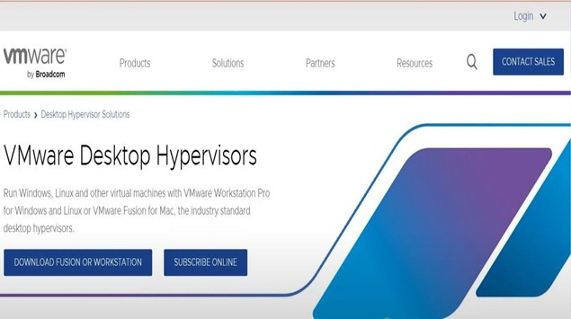
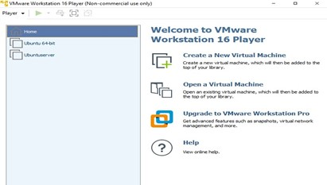

# *UBUNTU SERVER*

# CONTENTS

- [Introduction](#introduction)
  - [What is Ubuntu Server?](#what-is-ubuntu-server)
  - [Difference between Ubuntu Desktop and Ubuntu Server](#difference-between-ubuntu-desktop-and-ubuntu-server)
  - [Key Features](#key-features)
  - [Ubuntu Meaning and History](#ubuntu-meaning-and-history)
  - [Motivation](#motivation)
- [Objectives](#objectives)
- [System Requirements](#system-requirements)
- [How to Install Ubuntu Server?](#how-to-install-ubuntu-server)
- [Issues or Problems Faced](#issues-or-problems-faced)
- [Filesystem Support](#filesystem-support)
  - [Fully Supported Filesystems](#fully-supported-filesystems)
  - [Why Ext4 is Default?](#why-ext4-is-default)
  - [Partially Supported Filesystems](#partially-supported-filesystems)
- [Advantages](#advantages)
- [Disadvantages and Key Limitations](#disadvantages-and-key-limitations)
- [Recommendations for Improvement](#recommendations-for-improvement)
  - [User-Centric Future Vision](#user-centric-future-vision)
- [Conclusion](#conclusion)
- [Virtualization in Modern Operating Systems](#virtualization-in-modern-operating-systems)
  - [What is Virtualization?](#what-is-virtualization)
  - [Benefits of Virtualization](#benefits-of-virtualization)
  - [Main Components of Virtualization](#main-components-of-virtualization)
    - [Physical Machine](#physical-machine)
    - [Virtual Machine](#virtual-machine)
    - [Hypervisors](#hypervisors)
- [How Virtualization Works](#how-virtualization-works)
- [Reference](#reference)
  

# Introduction

## What is Ubuntu Server?

Ubuntu Server is a version of the Ubuntu operating system designed and engineered as a backbone for the internet. Ubuntu Server brings economic and technical scalability to your datacenter, public or private. Whether you want to deploy an OpenStack cloud, a Kubernetes cluster or a 50,000-node render farm, Ubuntu Server delivers the best value scale-out 
performance available. 

Ubuntu Server is a popular and dependable open-source operating system tailored for servers and cloud computing settings. It is a good choice for businesses and individuals seeking a reliable, ecure, and flexible operating system. Setting up Ubuntu Server in a virtual environmentprovides a versatile and economical option for businesses, developers, and IT professionals seeking to manage and implement servers without the need for dedicated physical hardware. 

Ubuntu Server is a variant of the Ubuntu operating system, specifically designed for server environments. Built on the Linux kernel, it provides a stable platform for hosting websites, running applications, and managing network services.  

 ## Difference between Ubuntu Desktop and Ubuntu Server 

 The main difference between Ubuntu Desktop and Server is the desktop environment. While Ubuntu Desktop includes a graphical user interface (GUI), Ubuntu Server does not. When choosing between Ubuntu Server and Ubuntu Desktop, the most important differences revolve around their intended use cases and interfaces. Ubuntu Desktop is designed for general personal computing, featuring a user-friendly graphical user interface (GUI) that is ideal for tasks like web browsing, office work, and media consumption. 

Ubuntu Server, on the other hand, is tailored for running network services, web hosting, and enterprise applications, relying on a command-line interface (CLI) to optimize performance and resource efficiency. Unlike the desktop version, Ubuntu Server doesn’t include a graphical user interface by default, making it lighter and more efficient for server use. Understanding these 
distinctions can help you select the appropriate version for your needs, whether it’s for everyday use, server management, or specific business applications. 

You should use Ubuntu Desktop to use your computer as a daily driver. It includes a bevy of multimedia and productivity software. There's a GUI, and installation is pretty simple. Moreover, you can install server software to use Ubuntu Desktop as a server.

## Key Features

One of its distinguishing features is its Long-Term Support (LTS) versions, which ensure stability and security updates for a minimum of five years. These attributes make Ubuntu Server particularly suited for environments requiring consistent performance and minimal downtime.

Key features of Ubuntu Server include: 

• Command-line interface for efficient remote management

• Lower resource requirements compared to desktop versions 

• Built-in security features and regular security updates 

• Support for a wide range of server applications and services 

• Scalability to meet growing business needs

## Ubuntu Meaning and History

The name “Ubuntu” comes from an African philosophy meaning “humanity to others” or “I am what I am because of who we all are.” This reflects the collaborative nature of the open-source community behind Ubuntu. Ubuntu Server is a Linux-based operating system developed by Canonical Ltd., designed for servers and cloud computing environments. It is derived from Debian and is composed mostly of free and open-source software Canonical, the company founded by South African entrepreneur Mark Shuttleworth, released the first version of Ubuntu in 2004. Ubuntu Server is built on Debian architecture and is composed mostly of free and opensource software. 

The history of Ubuntu Server dates back to the first release of Ubuntu in 2004. Initially, Ubuntu was perceived as a desktop-focused operating system, but its server capabilities were present from the beginning. Canonical, the company behind Ubuntu, emphasized its server potential by renaming the "Custom" installation mode to "Server," which marked the formal recognition ofUbuntu Server. Over time, Ubuntu Server gained popularity for its simplicity, reliability, and support for features like RAID and LVM, making it a strong choice for server users.

## Motivation

The motivation to choose Ubuntu Server stems from its compatibility with a wide range of hardware and virtualization technologies. As organizations continue transitioning to virtualized and cloud-based infrastructures, the need for an operating system that offers high scalability, cost efficiency, and robust performance becomes critical. Ubuntu Server is optimized for virtual environments such as VMware Workstation and Oracle VM VirtualBox, making it an ideal 
candidate for learning, development, and enterprise-level deployment. 

Additionally, its extensive documentation and community support lower the entry barrier for administrators, developers, and businesses looking to deploy an efficient and reliable server solution. With security at its core and support for advanced tools like Kubernetes and OpenStack, Ubuntu Server meets the demands of modern IT landscapes.

# Objectives

The objectives of the Ubuntu Server operating system are centered around providing a reliable, secure, and efficient platform for server environments. Here are some of its key objectives: 

1. **Stability and Reliability:** Ubuntu Server aims to deliver a stable and dependable operating system for hosting critical applications, ensuring minimal downtime and consistent performance. 

2. **Security:** It prioritizes robust security features, including regular updates, built-in firewalls, and support for encryption, to protect sensitive data and systems. 

3. **Scalability:** Designed to scale with growing business needs, Ubuntu Server supports a wide range of hardware and virtualization platforms, making it suitable for small-scale deployments and large enterprise infrastructures. 

4. **Flexibility:** The operating system is highly customizable, allowing users to tailor it to their specific requirements, whether for web hosting, database management, or cloud computing. 

5. **Cloud and Virtualization Support:** It is optimized for modern IT environments, offering seamless integration with cloud platforms like OpenStack and Kubernetes, as well as virtualization tools like VMware and VirtualBox. 

6. **Open-Source Philosophy:** Ubuntu Server promotes the use of free and open-source software, encouraging collaboration and innovation within the global community. 

7. **Ease of Use:** Despite being a server-focused OS, Ubuntu Server is designed to be user-friendly, with extensive documentation and community support to assist users of all skill levels.

# System Requirements

Ubuntu Server provides a flexible base for your solution that can run on a wide range of hardware, from small virtual machines to enterprise-scale computing. Hard requirements depend on the scenario. 

Ubuntu Server 24.04 LTS (the latest version at the time of writing) has modest hardware requirements, making it suitable for a wide range of systems: 

• **CPU:** 1 GHz or better (x86-64 processor) 

• **RAM:** 1 GB (2 GB recommended for comfortable use) 

• **Storage:** 2.5 GB for minimal installation (10 GB or more recommended for most use cases) 

• **Network:** Ethernet adapter (for network installation)

For running Ubuntu Server 24 on VMware or other virtualization platforms, similar requirements apply. However, you may want to allocate more resources depending on your specific use case and the applications you plan to run. 

• **Compatible Hardware:** Ensure your hardware meets the minimum requirements 
(e.g., 2 GHz dual-core processor,). 

• **Bootable Media:** Create a bootable USB drive or DVD with the Ubuntu Server ISO 
file. (This is required if you are not using virtual machine environment like VMware workstation or Oracle virtual box.) 

• **Internet Connection:** A stable internet connection for downloading updates and 
additional packages. 

• **Backup Data:** Backup any important data before installation. 

• A tool like **Rufus** (for Windows) or **Startup Disk Creator** (for Ubuntu) to create a bootable USB.

# How to Install Ubuntu Server?

The process of downloading Ubuntu Server and setting it up on VMware allows users to leverage virtualization for testing, development, and deployment without requiring dedicated hardware. It is an ideal setup for learning server administration, exploring cloud technologies, or managing enterprise-level applications. 

**Step 1: Prepare VMware Workstation** 
1. Download and install VMware Workstation from the official VMware website. Ensure your system meets the minimum hardware requirements.  

2.Launch VMware Workstation and ensure you have administrative access on your device.  

**Step 2: Acquire the Ubuntu Server ISO File**

1. Visit the official Ubuntu website and download the latest stable version of the Ubuntu Server ISO file.

**Step 3: Create a New Virtual Machine in VMware Workstation.**

1. Open VMware Workstation and click **"Create a New Virtual Machine."**

2. Choose **Custom (advanced)** or **Typical (recommended)** as per your preference. 

3. In the wizard: 

• Select **Installer disc image file (ISO)** and browse for the downloaded Ubuntu Server ISO file. 

• Name the virtual machine and choose the location where it will be stored. 

• Specify the virtual machine’s hardware configuration (e.g., RAM, CPU cores, disk space). All those details must meet the required software and hardware information listed above. 

**Step 4: Configure the Virtual Machine.**

1.Set the recommended resources for Ubuntu Server: 

**RAM:** At least 1 GB (for basic installation; adjust based on your use case). 

**Disk space:** At least 10 GB (for a minimal installation; more for additional packages).

2. Configure the virtual network (choose NAT or Bridged based on your setup 
requirements). 

3. Complete the virtual machine creation process.

 
**Step 5: Start the Installation**

 
 
1. Select the newly created virtual machine and click **Power on this virtual machine.** 

2. Follow the Ubuntu Server installation prompts: 

• Choose the language, keyboard layout, and time zone. 

• Configure the network settings (automatic or manual). 

• Set up partitions (let Ubuntu auto-configure or customize as needed). 

• Enter user credentials and password.

**Step 6: Finish Installation**

1. Complete the setup process and let the installation finish. 

2. Once completed, restart the virtual machine within VMware Workstation. 

3. Log in to the server with the user credentials you created.

# Issues or Problems Faced

The error message on my screen suggests that Intel VT-x is disabled, preventing virtual machine from starting in VMware Workstation 16 Player. Here's a step-by-step solution to fix : 

1. Go to Windows settings and select **Update &Security.** 

2. Select the **Recovery option.** 

3. Under the Advanced startup click on **Restart now.** 

4. Then on the blue screen displayed choose an option **Troubleshoot.** (Just single click on it) 

5. Select **Advanced options.** 

6. Select **UEFI Firmware settings.**

7. Finally, select the **Restart** button. This will reboot the system and after a while it will display different keys. 

8. Then on the keys listed press f10 to access **BIOS Setup**. 

9. Under the system configuration tab <enable> the Virtualization technology. 

10. Press f10 to save the changes and exit.

# Filesystem Support

File systems divide the storage space on a drive into virtual compartments known as clusters, maintain an index of where individual files are located and of available free space. The first Windows file system was known as the File Allocation Table or FAT, with three major variants developed, known as FAT12, FAT16 and FAT32. Each FAT variant can divide a drive into an increasing number of clusters and supports an increasing maximum file size and volume size. 
Ubuntu Server primarily supports **Linux-native filesystems**, though it can work with some others via additional drivers. Here's a breakdown:

## Fully Supported Filesystems:

1. **Ext4** – The default and most widely used Linux filesystem. ext4 was introduced which is the most modern dedicated Linux file system. ext4 has a maximum file size of 16 terabytes and the maximum volume size of 1 exabyte. It's reliable, supports journaling (for data integrity), and is well-integrated with Ubuntu. 

#### Why Ext4 is Default?

  • **Stability:** Ext4 is rock-solid and tested extensively in production environments. 

  • **Performance:** Handles large files well, reducing fragmentation. 
  
  • **Compatibility:** Works seamlessly across all Linux distributions. 

  • **Journaling:** Protects against data corruption in case of system crashes. 
   
If you're setting up an Ubuntu server, **Ext4** is the safe default, while ZFS or Btrfs could be worth considering for advanced storage needs. 

2. **Btrfs** – A modern filesystem with advanced features like snapshots and checksums, good for redundancy and scalability.

3. **ZFS** – Known for strong data integrity, compression, and powerful RAID-like features.By integrating physical drive management with file system functionality, ZFS provides increased protection against data loss or corruption. ZFS is currently available for Linux, FreeBSD and TrueOS and in the future may be ported to Windows and Mac OS. Ubuntu provides built-in ZFS support.

## Partially Supported Filesystems:

1. **NTFS** – Can be used via the ntfs-3g driver, but performance isn't optimal for Linux. NTFS also supports file permissions, file encryption and other features that make NTFS more suitable than a FAT32. The only real downside of NTFS is a lack of compatibility with older versions of Windows and non-Windows operating systems. For example, by default NTFS volumes are read-only in Mac OS and in older Linux distros, and may not be readable at all on other devices such as standalone media players. 

2. **FAT32 / exFAT** – FAT32 can store individual files up to 4 gigabytes in size and is limited to 32 gigabyte volumes if formatted in Windows, up to 2 terabytes when formatted with other operating systems, and has an absolute maximum volume size of 16 terabytes. FAT32 remains a popular filesystem due to its high level of compatibility across operating systems. 

    **exFAT** is less sophisticated than NTFS but has significant benefits over FAT32. The maximum file size is 16 exabytes or effectively unlimited. Many Linux systems require extra drivers to be installed to access exFAT devices. Supported via additional packages, useful for external drives and compatibility with Windows/Mac. 

3. **HFS+** – it is the extended version of HFS or known as Mac OS Extended. This edition wil Read and write support available, but lacks full journaling features. 

4. **APFS** – Apple's proprietary filesystem is not natively supported, but experimental read support exists. 

   • HFS+ and APFS are not natively supported by Windows, Linux or other non
Apple operating systems.

# Advantages

As an open-source platform, the Linux-based Ubuntu Server merits serious consideration given its reliability, security, and cost-effectiveness. 

Let’s recap the benefits that come with Ubuntu Server: 

**1.Free Operating System for Personal and Enterprise Computing**

One of the main advantages of Ubuntu is that it is a free-to-download and open-source desktop operating system. In other words, unlike Windows from Microsoft and the macOS from Apple, individuals and organizations can own and use personal computers and workstations without the need for purchasing software licenses or purchasing exclusive devices. 

**2.Works in a Wide Range of Devices and Computing Platforms** 

This OS can be installed on most computers and alongside other desktop operating systems such as Windows and macOS. It has a default support for processors based on the CISC-based x86-64 architecture such as Intel Core and AMD Athlon or AMD Ryzen and also supports processors based on various RISC-based architectures such as ARM and Power ISA. 

**3.A Well-Rounded Operating System for Desktop Computing**

Another advantage of Ubuntu is its intuitive and straightforward graphical user interface that provides its users with a familiar user experience. It can compete against Windows and macOS in terms of offering a complete desktop computing experience. The minimalist visual design is also similar to the clean and simple design principle of Apple operating systems. 

**4. Ease of Installing and Running and Customization Options** 

The installation process is straightforward and guided. It is doable even for users with limited technical knowledge. This operating system can also run from a bootable external storage medium such as an optical disc or a USB flash drive. There is also less need for manual driver installation because it automatically detects and configures most hardware. 

A live environment is available for preview before installation. Users can personalize the desktop environment by changing the themes, icons, and other settings. The operating system also allows experienced users to access the terminal for performing advanced tasks and customization settings. It also offers a range of tools and libraries for software development. 

**5. Light Operating System With Minimal System Requirements**

The default Ubuntu does not require high-end system requirements. The recommended hardware configurations are a 2 GHz dual-core processor, 4GB of RAM, and 25GB of storage space. The specific lightweight Ubuntu flavors or variants called Lubuntu and Xubuntu are developed and optimized for computers with lower-end hardware specifications. 

It is also important to reiterate that another advantage of Ubuntu is that it can be downloaded as a disk image and can run from an external storage medium such as a removable solid-state drive, a USB flash drive, and optical media. A live operating system works almost the same as an installed operating system without altering the configuration of the computer. 

**6.Continued Support from Developers and the Community**

Remember that this operating system is open-source. One of the many benefits of open-source software is that there is an active community that helps in providing bug fixes and introducing or rolling out new updates or features faster and more efficiently.

# Disadvantages and Key Limitations

**1. Limited Functionalities Due to Limited Applications** 

One of the major disadvantages of Ubuntu is the limited choices of applications. The app store is sizeable but it is still not comparable to Windows and macOS. Most software developers prefer developing first for Microsoft and Apple because of their larger user bases. 

**2. Also Has Limited and Unimpressive Game Titles**

It is also important to note that this is not an operating system for PC gamers. There are few game titles available for Linux distributions. Most of these titles are unimpressive because they are too simple or lack advanced gameplay and immersive graphical experience. 

**3. Problems About Software and Hardware Compatibility**

Some users have reported driver issues or compatibility between the operating system and the hardware specifications of their computers. There have been occasional stories of wireless card drivers not working or a printer not connecting to the computer due to an unidentified hardware problem. 
 
**4. Issues About Commercialization Versus Open Source** 

One of the main criticisms of Ubuntu is its apparent commercialization. Canonical appears to move a little bit further away from the open-source model with each operating system update. The company works on its own most of the time instead of working with the open-source community. This prevents receiving inputs from hundreds of volunteer developers. Understanding error messages and navigating logs might require technical knowledge or community support. 

**5.  Troubleshooting Issues and Absence of Dedicated Support** 

The entire graphical user interface of this operating system is intuitive. However, when it comes to troubleshooting, beginners and even intermediate users might still struggle.  

It is also worth mentioning that another disadvantage of Ubuntu, as well as of other open-source and free operating systems, is the lack of dedicated technical support. The sole option for users is the open-source community. Canonical does not maintain a team dedicated to answering user inquiries or helping with troubleshooting and other technical issues.

# Recommendations for Improvement

**✓ Simplify Beginner Troubleshooting**  
 
A lack of specialized technical help makes troubleshooting Ubuntu Server difficult for many users. Canonical might make technical problems easier for novices and non-expert users by implementing user-friendly features like streamlined logs or guided error 
resolution interfaces. 

**✓ Increase the Application Ecosystem**

Limited application options are frequently cited by users as a disadvantage. Canonical might work with developers to include more popular software into Ubuntu Server, especially enterprise-grade programs and gaming apps. It would become much more appealing if it were compatible with other commonly used tools. 

**✓ Improve the Integration of Community Support**

Although the open-source community is a great resource, Ubuntu Server users would gain from community solutions being more closely integrated into the operating system. Users could find answers more rapidly, for example, if system utilities included community-driven FAQs, tutorials, or solutions.  

**✓ Boost Driver Compatibility**  

Users may become frustrated by sporadic incompatibilities with particular devices, like wireless cards or printers. To guarantee seamless interoperability across all devices, Canonical should keep concentrating on creating universal drivers and collaborating closely with hardware manufacturers.

**✓ Boost Open-Source Cooperation** 

One popular criticism is that Ubuntu is becoming more commercialized. Canonical can restore user confidence in the open-source ideology by re-engaging with the community more thoroughly and making sure that upgrades continue to adhere to collaborative development norms. 

**✓ Introduce Easier GUI Options for Beginners**

While advanced users appreciate the efficiency of the command-line interface, 
newcomers often struggle with it. Providing optional lightweight graphical tools or guided configuration setups within Ubuntu Server would lower the entry barrier for inexperienced users. 

**✓ Focus on Accessibility for All Users**

Canonical can explore developing Ubuntu Server features tailored for smaller-scale personal use cases, like home servers and hobby projects, as these are becoming increasingly popular. Expanding documentation and tutorials targeting such use cases could further engage users. 

**✓ Emphasize Advanced Security Features**

While Ubuntu Server already provides robust security, adding user-friendly tools for encryption management, security auditing, or vulnerability scanning would enhance its appeal to both individual users and organizations.

## User-Centric Future Vision

By implementing these user-focused recommendations, Ubuntu Server can strengthen its position as the go-to server OS for diverse user groups, from beginners to seasoned IT professionals. Its rich features and strong community support give it an edge, and with continued attention to user needs, it has the potential to grow even more indispensable in the evolving IT landscape.

# Conclusion

Ubuntu Server stands out as a robust, dependable, and adaptable operating system, suitable for both conventional server setups and contemporary cloud computing environments. Its opensource nature guarantees affordability, flexibility, and strong community backing. Canonical’s Long-Term Support (LTS) releases further improve its reliability by offering assured security updates and stability for prolonged durations.  

The use of the default Ext4 filesystem illustrates Ubuntu Server's dedication to stability, efficiency, and compatibility, making it a top choice for various server implementations. For more specialized requirements, filesystems such as Btrfs and ZFS offer capabilities like snapshots, data redundancy, and enhanced data integrity, addressing the needs of more demanding enterprise settings. 

Though Ubuntu Server excels in numerous aspects, including scalability, security, and support for leading-edge tools like Kubernetes and OpenStack, it does have its drawbacks. Issues such as limited gaming compatibility, occasional hardware issues, and the necessity for technical know
how in troubleshooting must be recognized. 

To sum up, Ubuntu Server emerges as a top choice for both organizations and individuals in search of a secure, scalable, and versatile server operating system, ideally equipped to meet the evolving requirements of today’s IT environments.

# Virtualization in Modern Operating Systems

## What is Virtualization?

Virtualization is a technology that enables the creation of virtual environments from a single physical machine, allowing for more efficient use of resources by distributing them across computing environments. 

Using software, virtualization creates an abstraction layer over computer hardware, dividing a single system’s components such as processors, memory, networks and storage into multiple virtual machines (VMs). Each VM runs its own operating system (OS) and behaves like a separate physical computer, despite sharing the same underlying hardware. 

Today, virtualization is a fundamental practice in enterprise IT architecture and a key enabler of cloud computing. It allows cloud service providers (CSPs) such as IBM Cloud®, Microsoft Azure, Google Cloud and Amazon Web Services (AWS), to optimally utilize their IT infrastructure to deliver scalable resources. For businesses, this means they only purchase the computing resources they need and then scale them cost-effectively as their workloads grow, maximizing their investment.

## Benefits of Virtualization

Virtualization offers numerous benefits to both on-premises and cloud-based data centers that support IT operations, including the following: 

• Resource efficiency 

• Easier management 

• Minimal downtime 

• Faster provisioning 

• Disaster recovery (DR) 

• Cost-effectiveness 

## Main Components of Virtualization

Virtualization relies on several key components to create and manage virtual environments. Each plays a vital role in ensuring the effective allocation of resources so multiple VMs can run simultaneously without interference.

• Physical machine (server/computer) 

• Virtual machine (VMs) 

• Hypervisor 

### Physical Machine

The physical machine, also referred to as the “host machine” is the hardware (e.g., server or computer) that provides CPU, memory, storage and network resources for the virtual machines.

### Virtual Machine

A virtual machine (VM) is a virtual environment that simulates a physical computer in software form. VMs are usually referred to as guests, with one or more “guest” machines running on a host machine. Virtual machines typically consist of several files, including the configuration, storage for the 
virtual hard drive and other dependencies. By sharing system resources among virtual machines, virtualization offers on-demand scalability, efficiency and cost savings.

### Hypervisors

A hypervisor is the software layer that coordinates VMs. It serves as an interface between the VM and the underlying physical hardware, ensuring that each has access to the physical resources it needs to execute. It also makes sure that the VMs don’t interfere with each other by impinging on each other’s memory space or compute cycles.

# How Virtualization Works

Virtualization works by creating virtual versions of physical computing resources, such as servers, storage, or networks, using specialized software called a hypervisor. The hypervisor abstracts the underlying hardware and allows multiple virtual machines (VMs) to run independently on the same physical system. Each VM operates as if it were a separate computer, with its own operating system and applications. This technology enables efficient resource utilization, scalability, and flexibility, making it a cornerstone of modern IT infrastructure, especially in cloud computing and data centers. 

# Reference

- [Ubuntu Server Download](https://ubuntu.com/download/server)

- [	Wikipedia: Ubuntu](https://en.wikipedia.org/wiki/Ubuntu)

-  [Ubuntu Server System Requirements](https://ubuntu.com/download/server#system-requirements-lts)

-  [VMware Workstation download](https://blogs.vmware.com/workstation/2020/09/workstation-16-now-available.html)

-  [Profolus: Advantages and Dsadvantages of Ubuntu server](https://www.profolus.com/topics/ubuntu-operating-system-advantages-and-disadvantages/)

- [Ubuntu server documentation/tutorial](https://documentation.ubuntu.com/server/tutorial/basic-installation/#basic-installation)

- [Ubuntu server vs. Ubuntu desktop](https://www.makeuseof.com/tag/difference-ubuntu-desktop-ubuntu-server/)

- [server acadamy:](https://serveracademy.com/blog/ubuntu-server-vs-desktop/#:~:text=and%20use%20cases.-,Ubuntu%20Server%20vs%20Desktop%20vs%20Core%20Table,management%2C%20or%20specific%20business%20applications)
